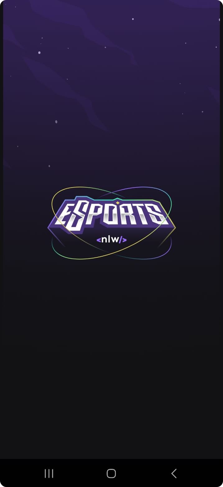
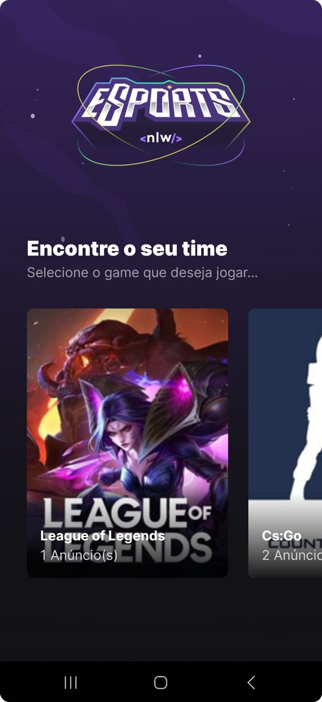
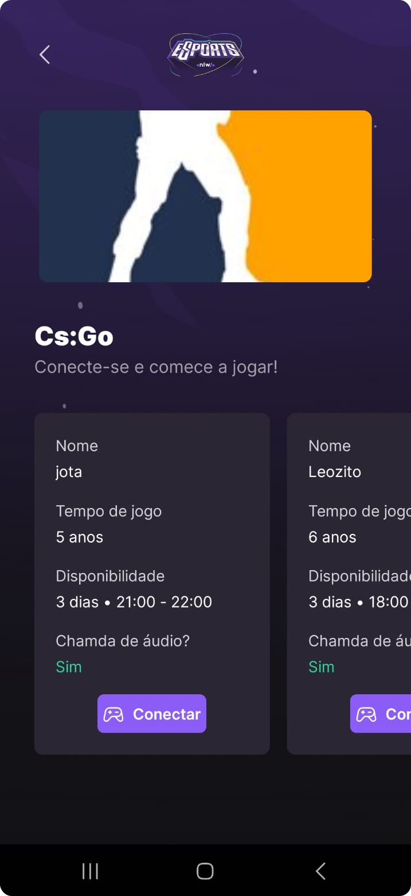

  

## 📚 Sobre

O NLW eSports é um projeto desenvolvido junto com a Rocketseat no evento realizado, na Trilha Ignite, estudamos React Native com Expo.

## 🚀 Projeto

A plataforma tem como foco o público gamer, conectar jogadores, o sistema permite que você selecione o seu jogo e procure jogadores cadastrados que estão disponíveis para se conectar e jogar. Na aplicação mobile, o usuário pode acessar os anúncios e visualizar as informações de cada usuário, assim também com acesso ao Discord, sendo assim possível copiar para a área de transferência o nome de usuário do Discord do jogador para adicioná-lo.

## 📱 Preview

    
    
    

## 📎 Tecnologias

- [Typescript](https://www.typescriptlang.org/docs/)
- [React Native](https://reactnative.dev/)
- [Expo](https://expo.dev/)
